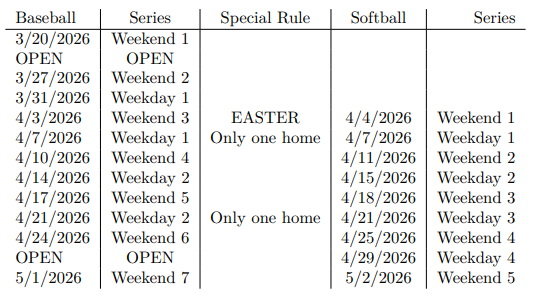
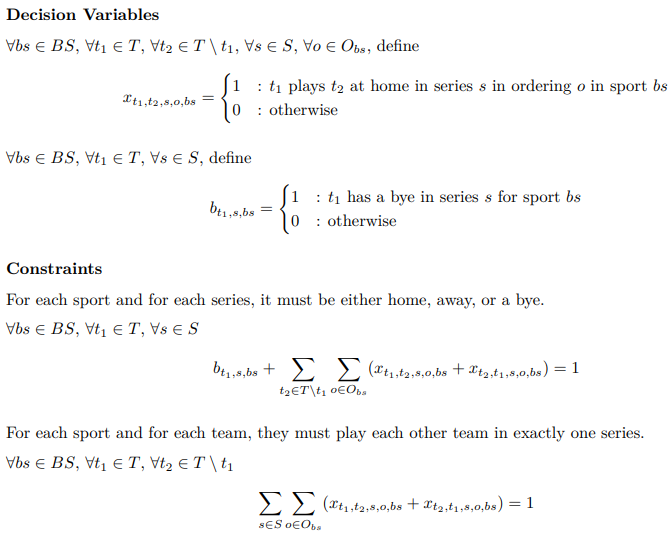
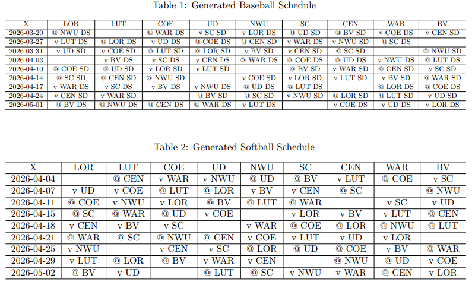

# BaseballSoftballScheduling--CSC-335

This Operations Management Project used Linear Programming techniques to model, solve, and optimize the linear program for the 2026 Baseball and Softball schedules for the American Rivers Conference given a set of parameters the schedule must follow. We used R to build the linear program from the following requirements:

* Each team in each sport must play each other team exactly once across all series
* Each series must be either home, away, or a bye for each team in each sport
* Each team in each sport gets exactly one bye per season
* There may not be more than 2 consecutive home series for each team in each sport
* There may not be more than 2 consecutive away series for each team in each sport
* Each team in each sport gets exactly 4 home games and 4 away games per season
* Each team in each sport must have at least one home weekend series in one of the last 3 weekend series
* For each weekday series in softball, if a team is at home for a series, the corresponding baseball team is not at home for the corresponding weekday series, and vice-versa
* For the first baseball series of the season, schools without turf must not be at home
* For team in each sport, for each team they are long distance from, they must play at home or away on one weekend series
* For team in each sport, for each team they are local to, they must play at home or away on one weekday series
* For each baseball series, it must follow proper ordering specifications
* Loras must have a bye on Easter for Baseball and Softball
* Dubuque Baseball in 2026 must have a bye on a weekday series

Then, we used COIN-OR CBC Solver to generate a possible schedule of games, and finally tweaked the formatting in R to output the schedule in a human-readable format.

Date: December 2024

Members: Riley Fiske, Isaac Wayne

[Read the Full Report Here](https://github.com/rdfiske17/BaseballSoftballScheduling--CSC-335/blob/main/Final_Project_Report_A-R-C_Baseball_Softball_Scheduling.pdf)
